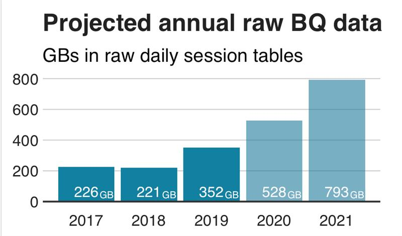

<link rel="stylesheet" href="styles.css" type="text/css">
<!---->

Welcome to my redesigned website! It was built completely in R (RStudio) & is hosted on GitHub.

#### Programming:  R - Python - SQL - Shell (Bash)
#### Google Cloud Certified 
#### Modeling:
##### Predictive Modeling - Data Driven Attribution
##### Clustering - Customer Segmentation
##### Customer Lifetime Value - Churn Prediction

 

### R

* [**tidyverse**](https://www.tidyverse.org/):
  * The tidyverse is an opinionated collection of R packages designed for data science. All packages share an underlying design philosophy, grammar, and data structures.

* **ggplot2**: 
  * An explanatory plot recently developed for a client forecasting their estimated data storage costs in [Google BigQuery](https://cloud.google.com/bigquery/)

### Python

* numpy
* pandas
* sci-kit learn 

### Modeling

* Forecasting (time-series)
* Machine Learning
* Linear and Logistic Regression

### SQL

* Window functions
* Common Table Expressions
* BigQuery Standard SQL

Have a look at my [CV](https://docs.google.com/document/d/140V8w_9ULxasPt1undqa-iB3GUzr14LRm5vrmcpMCF4/edit#heading=h.8v78y56onko) to learn more! 

